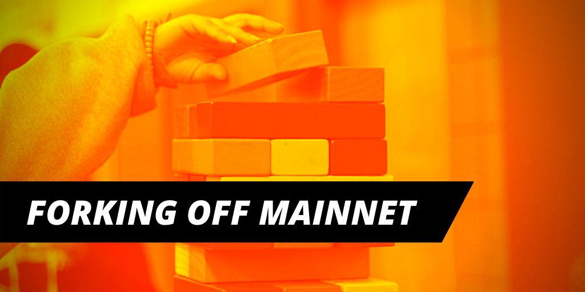

## The problem

> That's four complex protocols! Where do I even start?

While building [Dedge](https://dedge.exchange), we realized we had to interface with at least three major protocols in order to swap debt on Compound. In this one "simple" transaction, we interact with:

- [AAVE](https://aave.com) — for a [flash loan](https://aave.com/flash-loans)
- [Uniswap](https://uniswap.exchange) — for getting the tokens we want
- [Compound](https://compound.finance/) — to repay and borrow debt

You can start to see why this might be just a little bit intimidating, and this is _before_ implementing our additional feature of importing [Maker](https://makerdao.com/) Vault positions. That's four complex protocols! Where do I even start?

## Common approaches

Developing with multiple protocols is a crucial part of DeFi development, and currently none of the approaches are quite satisfactory. So we decided to talk to a bunch of DeFi startups, and find out what they were doing.

It turns out there are **two common approaches**: (1) writing mock contracts, and (2) deploying the protocol locally. Let's take a quick look at these two approaches.

### Mock contracts

Writing your own mock contracts and deploying them locally seem to be the most common strategy today. In essence, this is writing your own "dummy" smart contracts with the same interface as the real protocol that you want to interact with.


Of course, this means you have to return "realistic" dummy values that your dapp will react to. And determining what kind of values to return, how realistic these values are, and how it might affect your system is a very complex problem.

> You might start to feel like you're building the protocol from scratch!

Beyond that, your mock contracts can grow in complexity over time as you deal with more nuanced and complex behavior. At the end of the day, you might start to feel like you're building the protocol from scratch!

### Deploying the protocol locally

Another approach very rarily used is deploying the actual protocol itself locally. This means grabbing the actual Solidity source files for the protocol you are interested in, and then compiling and deploying locally.

Don't forget you still need to seed the contracts with a "realistic" state. There may be no easy way to do this, and you'll have to end up simulating multiple users (i.e. building your own Ethereum bots) just to get to that point.

Needless to say, it's very clear why most startups choose not to follow this strategy.

# The better way

The strategies above already sound pretty horrendous in and of themselves. Multiply that by the number of protocols you want to interact with and you start to see the problem.

Following the strategies above will put a huge burden on your development velocity. So after some thinking about this, we figured maybe we should just...


<br />

Basically, we want to just **work on Mainnet itself**. And the way to do that is to fork off Mainnet with a local test chain so we have access to the state and protocols that reside on Mainnet, while being able to develop locally.

## Advantages

Forking off Mainnet provides three key essential benefits:

1. Real and full liquidity
2. Everything on the same network
3. Development and production parity

Let's discuss each of these in-depth.

### 1. Real and full liquidty

If you need to work with a bunch of ERC20 tokens, you're going to need to source them from somewhere. Rather than simulating any of this, why not just "buy" the tokens from the real Uniswap itself?

Don't forget that each ERC20 token in the wild can have its own nuances (like different decimals and additional functionality) so it may not be trivial to just replace the actual thing with your own dummy ERC20 tokens.

This also applies to lending protocols like AAVE and Compound. Lending and borrowing behavior of these protocols can be very complex. And while nothing is impossible to simulate, it's just so much easier to work with the real thing.

### 2. Everything on the same network

Testnets like Ropsten and Rinkeby are the worst of both worlds. There are some protocols that only exist on one testnet but not on another (something might be on Ropsten, but not Rinkeby).

When you need to interact with more than one protocol, testnets are just not very helpful. You need to get test Ether from somewhere, and if you need access to certain ERC20 tokens you might very well be out of luck.

And finally, you still need to wait for each transaction to be mined. So testnets are only really good for testing very specific use-cases where you don't interact with many existing protocols.

### 3. Development and production parity

> Real world state can be dirty

Out of the box, you get **[dev/prod parity](https://12factor.net/dev-prod-parity)**, which is a very important concept in traditional app development. You want to be building in an environment that is as similar to the real thing as possible.

One major benefit here is that you'll be using the exact same addresses and ABIs in development _and_ production. That's one less source of uncertainty you'll have to worry about.

This allows you to catch edge-cases and nuances that are often not apparent in a sandboxed cleanroom-like environment. Real world state can be dirty, and it's best that you develop with that in mind rather than be surprised when you deploy.

# A short introduction

So how do we achieve all this?

Fortunately, the amazing folks over at [Truffle](https://www.trufflesuite.com/) have made a lovely tool called [Ganache](https://github.com/trufflesuite/ganache-cli/). Ganache is basically a test blockchain that you can run locally and it will insta-mine your transactions for you. Conveniently for us, it also has the ability to fork off Mainnet.

To fork off Mainnet, simply invoke the `-f` flag on `ganache-cli`.

```bash
npx ganache-cli -f https://mainnet.infura.io/v3/7d0d81d0919f4f05b9ab6634be01ee73
```

_This Infura API key is obtained publicly from [Ethers.js](https://github.com/ethers-io/ethers.js/blob/master/src.ts/providers/infura-provider.ts#L14)._

This will spawn a Ganache instance at `http://localhost:8545`. You can then try and interact with some Mainnet contracts, for example here's the full code to interact with `WETH` or [Wrapped Ether](https://weth.io/) which also uses our [Money-Legos](../npm-install-money-legos) library:

```javascript
const { legos } = require("@studydefi/money-legos")
const { ethers } = require("ethers")

const provider = new ethers.providers.JsonRpcProvider("http://localhost:8545")

const wallet = new ethers.Wallet(
  "0xb0057716d5917badaf911b193b12b910811c1497b5bada8d7711f758981c3773", // Default private key for ganache-cli -d
  provider
)

const wethContract = new ethers.Contract(
  legos.erc20.weth.address,
  legos.erc20.weth.abi,
  wallet
)

const main = async () => {
  await wethContract.deposit({
    value: ethers.utils.parseEther("1.0"),
    gasLimit: 1000000,
  })

  const wethBal = await wethContract.balanceOf(wallet.address)

  console.log(`WETH Balance: ${ethers.utils.formatEther(wethBal)}`)
}

main()
```

### "Gotchas" to be aware of

Unfortunately the Infura key from Ethers.js does not point to an archival node. That means you will have to to restart `ganache-cli` every 128 blocks (~30 minutes), otherwise you may be greeted with the following message from Infura:

> Returned error: project ID does not have access to archive state

We'll be doing a deep dive of this issue in the future (and how to get around it without paying $250 for an archival node). So make sure you subscribe!

# That's it?

Of course there's a lot more to developing on Mainnet than just running a Ganache instance.

We have created a testing harness that can give you a "fresh" Mainnet state for each of your test files thanks to Jest's ability to run its test suites in parallel.

Make sure you subscribe below so you can catch this next blog post when it comes out! And don't forget to follow our Twitter [@studydefi](https://twitter.com/studydefi).
