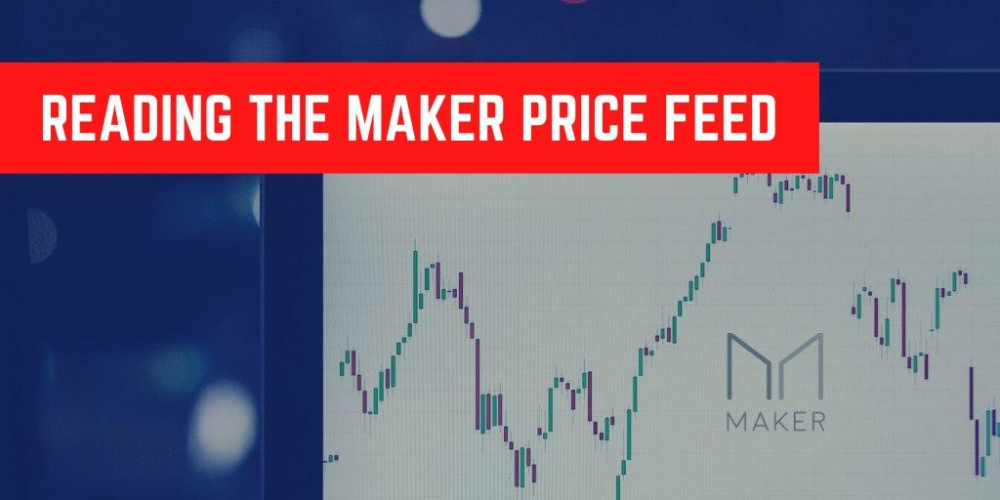
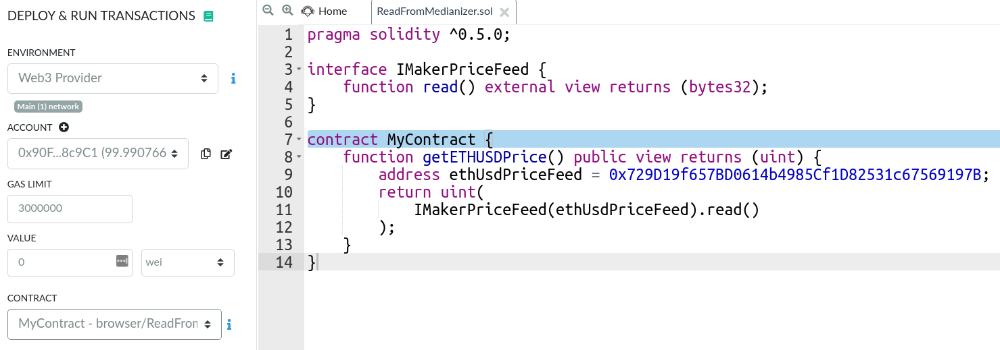
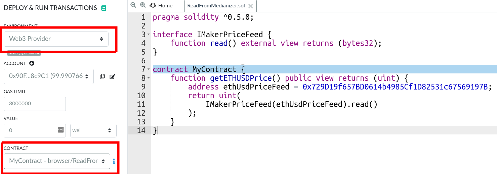
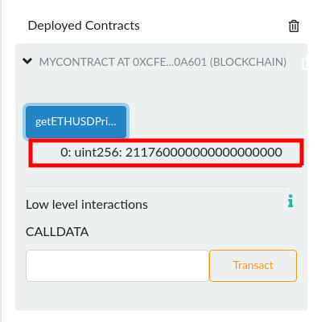
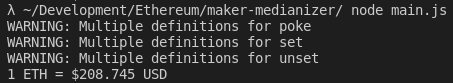

> A reliable on-chain ETH/USD price-feed, for free?

Yup, you heard me right - A __free__ on-chain price feed for ETH/USD (courtesy of [Maker](https://makerdao.com/)). Read on to find out how to use it in both Solidity and JavaScript!

## Solidity

To read from Maker's price feed, you'll need to add an interface with the function `read()` like so:

```js
interface IMakerPriceFeed {
    function read() external view returns (bytes32);
}
```

Note that the function returns `bytes32` so we will have to convert it into `uint` to make sense of it, like so:

```js
contract MyContract {
    function getETHUSDPrice() public view returns (uint) {
        address ethUsdPriceFeed = 0x729D19f657BD0614b4985Cf1D82531c67569197B;
        return uint(
            IMakerPriceFeed(ethUsdPriceFeed).read()
        );
    }
}
```

### Testing with Remix IDE

As we're reading off Mainnet data, we don't want to burn real ETH just to test a contract. As such, we would like to create a Ganache instance with mainnet data. Check out [our article on forking off mainnet](/forking-off-mainnet/) for more info on why we we prefer to do so.

Run the code below in a terminal, it'll create a Ganache instance with mainnet data.

```shell
npx ganache-cli -f https://mainnet.infura.io/v3/7d0d81d0919f4f05b9ab6634be01ee73
```

Head over to [Remix](https://remix.ethereum.org/) and paste the supplied code into the editor. 



Before clicking on deploy, make sure:
1. `Web3 Provider` is selected in the environment (use the defaults)
2. The right contract name is selected (`MyContract` in the example above)



If you've done everything correctly, your contract should be deployed and you should be greeted with something similar when you click on `getETHUSDPrice`:




## JavaScript

Testing with JavaScript is very straight forward. We don't need to create a Ganache instance that forks off mainnet as we're just reading data from the blockchain. We'll first need to setup our `Node.js` project:

```shell
npm init -y
```

We will then install `money-legos` and `ethers` as dependencies:

```shell
npm install @studydefi/money-legos ethers
```

Now create `main.js` and put the following inside:

```js
const { ethers } = require("ethers");
const maker = require("@studydefi/money-legos/maker").default;

const provider = new ethers.providers.InfuraProvider("homestead");

const makerMedianizer = new ethers.Contract(
  maker.ethUsdPriceFeed.address,
  maker.ethUsdPriceFeed.abi,
  provider
);

const readAndLog = async () => {
  const ethPriceUsd = await makerMedianizer.read();

  console.log(`1 ETH = $${ethers.utils.formatEther(ethPriceUsd)} USD`);
};

readAndLog();
```

---

Once you execute it, you should be greeted with the following:



Hurray!

# Wrapping Up
You can now read ETH/USD prices in both solidity AND JavaScript without the need for any API calls to some 3rd central party. How exciting is that?

Stay tune for more posts!