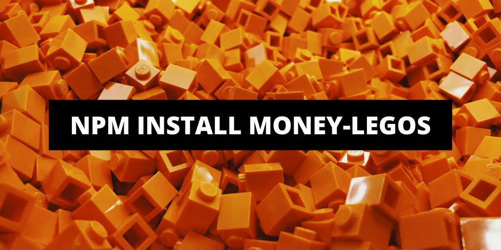
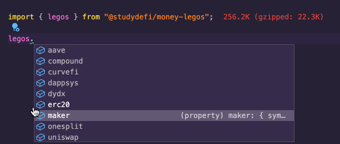
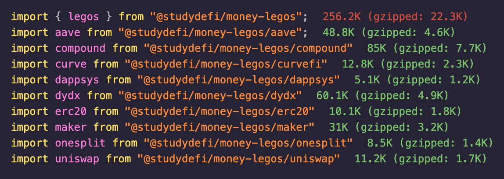

- Github: https://github.com/studydefi/money-legos
- Documentation: https://money-legos.studydefi.com/
- NPM: https://www.npmjs.com/package/@studydefi/money-legos

---

Here at [StudyDefi](https://studydefi.com), we understand how painful it is right now to build on top of existing mainnet DeFi protocols. We dealt with this first hand when building our first DeFi DApp [Dedge](https://dedge.exchange), which had to interact with Uniswap, MakerDAO, AAVE, Compound, etc.

Today, we're happy to announce that we will be open-sourcing a tool that we have been using heavily inside of [Dedge](https://dedge.exchange) called `money-legos`!

# Quickstart

`money-legos` is an NPM package that provides you with the **mainnet address** and the **ABI** for popular DeFi protocols.

It even has Typescript-powered autocomplete so you can quickly code integrations without the hassle of googling and copy and pasting all the time.



### 1. Install `money-legos`

```bash
npm install @studydefi/money-legos
```

### 2. Use it

```javascript
// import it into your project
const { legos } = "money-legos"

// instantiate contracts with it
const daiContract = new ethers.Contract(
  legos.erc20.abi,
  legos.erc20.dai.address,
  provider
)

// start interacting!
const balanceWei = await daiContract.balanceOf(
  "0xde0b295669a9fd93d5f28d9ec85e40f4cb697bae"
)
const balance = ethers.utils.formatEther(balanceWei)
console.log(`Balance of EF: ${balance.toString()}`)
```

### Won't this be too heavy?

If you don't want the added weight of all the protocols, you can import individual protocols separately. Here are the gzipped bundle sizes of each protocol as of April 2020:



To get a full sense of what protocols/ABIs it supports, check out the [GitHub repository!](http://github.com/studydefi/money-legos)
