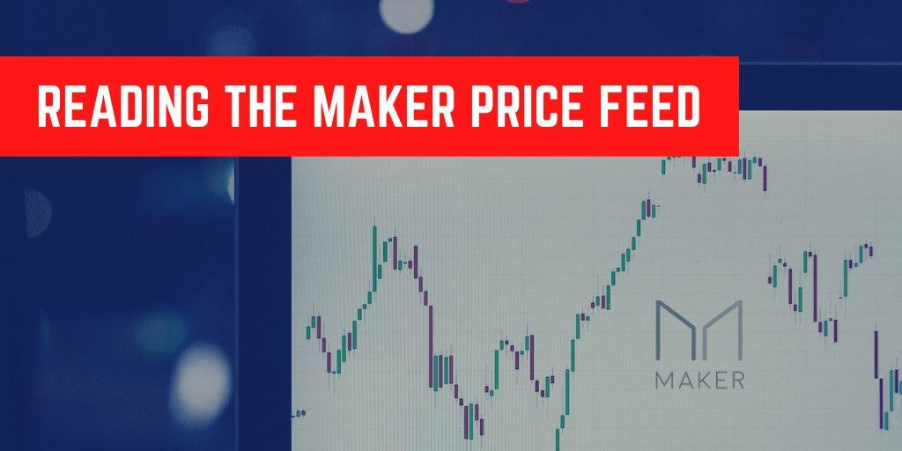
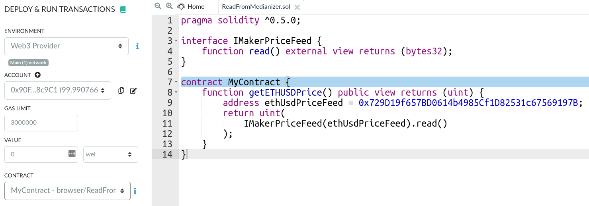
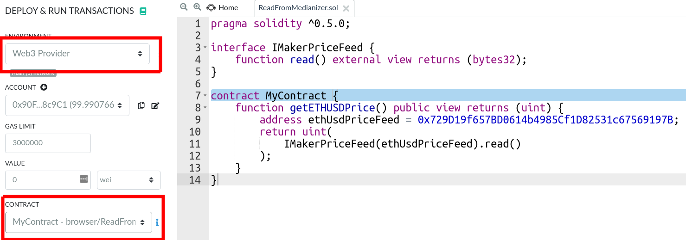
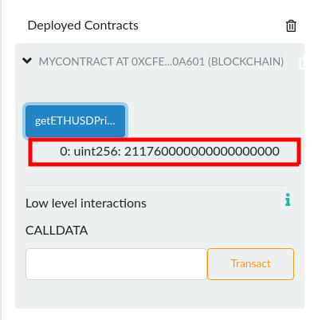
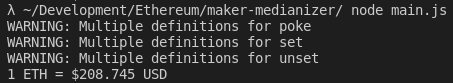

> A reliable on-chain ETH/USD price-feed, for free?

Yup, you heard me right - A **free** on-chain price feed for ETH/USD (courtesy of [Maker](https://makerdao.com/)). In this article, we'll show you how to do it in both Solidity and JavaScript!

But first, let's learn a little bit about the Medianizer.

## What is the Medianizer?

According to MakerDAO's developer [docs](https://developer.makerdao.com/feeds/):

> The reference price (ETHUSD) for the Maker system is provided via an oracle (the medianizer), which collates price data from a number of external price feeds.

It's essentially an on-chain price feed that aggregates from a bunch of trusted sources. But the price you get isn't the instantaneous spot price of ETH on exchanges. In fact, it is currently delayed by an hour due to something called the [Oracle Security Module (OSM)](https://docs.makerdao.com/smart-contract-modules/oracle-module/oracle-security-module-osm-detailed-documentation).

The Medianizer has had a pretty good track record and and has been around since the days of Single Collateral DAI. If you want to read more about the Medianizer and how it's secured, check out the docs [here](https://community-development.makerdao.com/makerdao-mcd-faqs/faqs/oracles).

Now let's get to the hands-on portion of this article!

## Reading the Medianizer from Solidity

To read from Maker's price feed, you'll need to add an interface with the function `read()` like so:

```js
interface IMakerPriceFeed {
  function read() external view returns (bytes32);
}
```

Note that the function returns `bytes32`, which is not a number. So we will have to convert it into `uint` to make sense of it. To do that, we will wrap the return value of the `read()` function in a `uint()` like so:

```js
contract MyContract {
  function getETHUSDPrice() public view returns (uint) {
    address ethUsdPriceFeed = 0x729D19f657BD0614b4985Cf1D82531c67569197B;
    return uint(
      IMakerPriceFeed(ethUsdPriceFeed).read()
    );
  }
}
```

And that's it! It's actually quite simple, so now let's test it out.

### Testing with Remix IDE

Since we're reading data from Mainnet state, this tiny contract of ours will need to be deployed onto a network with access to Mainnet state. A simple test chain won't work because they don't have access to Mainnet data...

That is unless you've read our article on [forking off mainnet](/forking-off-mainnet/)! Run the code below in a terminal to create a Ganache instance with access to Mainnet state.

```shell
npx ganache-cli -f https://mainnet.infura.io/v3/7d0d81d0919f4f05b9ab6634be01ee73 -i 1
```

Head over to [Remix](https://remix.ethereum.org/) and paste both the `IMakerPriceFeed` interface and the `MyContract` contract into the editor:



Before clicking on deploy, make sure:

1. `Web3 Provider` is selected in the environment (use the defaults)
2. The correct contract name is selected (i.e. `MyContract`)



If you've done everything correctly, your contract should be deployed and you should be greeted with something similar to this when you click on `getETHUSDPrice`:



Obviously this number will vary depending on the price of Ether at the time the function was executed 😂.

## Reading the Medianizer from JavaScript

Testing with JavaScript is very straight-forward. Especially since we can grab the ABI and address from the [Money-Legos](https://github.com/studydefi/money-legos/) package.

We also don't need to create a Ganache instance that forks off Mainnet since we're just reading data from the blockchain. There's nothing to deploy, unlike the Solidity example above.

We'll first need to setup a `Node.js` project:

```shell
npm init -y
```

We will then install `money-legos` and `ethers` as dependencies:

```shell
npm install @studydefi/money-legos ethers
```

Now create a file named `main.js` and put the following inside:

```js
const { ethers } = require("ethers")
const maker = require("@studydefi/money-legos/maker")

const provider = new ethers.providers.InfuraProvider("homestead")

const makerMedianizer = new ethers.Contract(
  maker.ethUsdPriceFeed.address,
  maker.ethUsdPriceFeed.abi,
  provider
)

const readAndLog = async () => {
  const ethPriceUsd = await makerMedianizer.read()

  console.log(`1 ETH = $${ethers.utils.formatEther(ethPriceUsd)} USD`)
}

readAndLog()
```

Execute the file in the terminal with `node main.js` and you should be greeted with the following:



Hurray! Let's see how well this article will age 😂.

**Note:** Those warnings are just an Ethers.js logging artifact that can be turned off by setting the log level at the top of the file:

```js
ethers.errors.setLogLevel("error")
```

# Wrapping up

You can now read ETH/USD prices in both Solidity _and_ JavaScript without the need for any API calls to some centralized 3rd party. How exciting is that?

Stay tuned for more posts! And don't forget to follow us on Twitter [@studydefi](https://twitter.com/studydefi) and come say hi on [Discord](https://discord.gg/rBr3U32). Also make sure to check out our NPM package [Money-Legos](https://github.com/studydefi/money-legos/) and give us a star if you like it.
