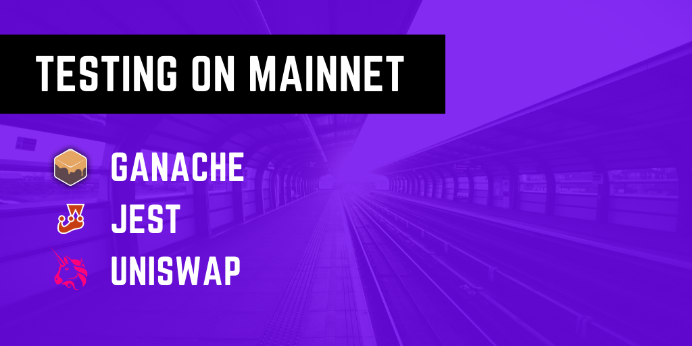
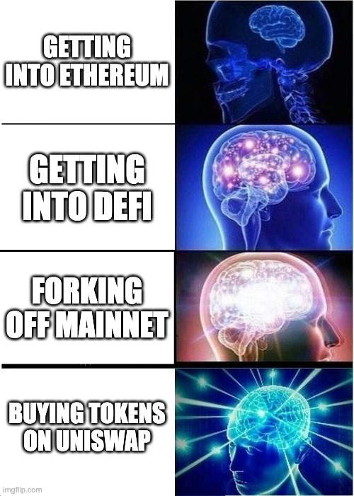
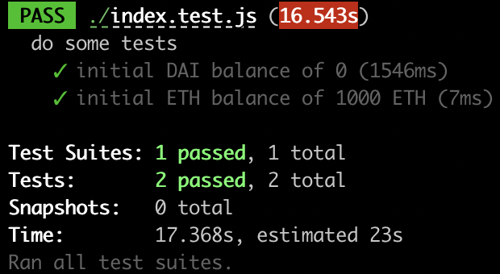
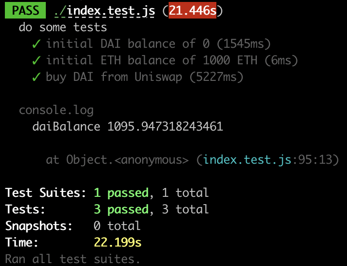

<br />

> I want to dev on Mainnet, but how do I get started?

In our previous post, maybe we convinced you to [fork off Mainnet](<(../forking-off-mainnet)>). This article picks up where the last one left off and provides practical steps in creating your own setup.

In this article, we will walk through creating your own test harness with [Jest](https://jestjs.io/) and [Ganache](https://github.com/trufflesuite/ganache-core). And not only that, we will demonstrate **actual interaction with on-chain protocols** within your tests.

By the end of this tutorial, your test suite will be swapping coins on [Uniswap](https://uniswap.exchange/).



## Tutorial

> Wow! A tutorial on interacting with Mainnet protocols

You can to skip straight to this [repository](https://github.com/studydefi/minimal-testing-tutorial) with the complete code for this tutorial. Or you can look through our testing setup in the [money-legos](https://github.com/studydefi/money-legos) package.

If you find this page too long, don't worry. The tutorial (and code) is actually very short, but this page is long because we have explanations for every step of the way.

Now let's get started.

### Setup

Create a new directory, and initialize a Node.js project:

```shell
npm init -y
```

Then we will install `money-legos` and `ethers` as `dependencies`:

```shell
npm install @studydefi/money-legos ethers
```

And install `ganache-core` and `jest` as `devDependencies`:

```shell
npm install -D ganache-core jest
```

### Setting up the forking logic

Now create a test file `index.test.js` and put the following inside:

```js
const { ethers } = require("ethers")
const Ganache = require("ganache-core")

const MAINNET_NODE_URL = "<insert mainnet node url here>"
const PRIV_KEY = "<insert ANY private key here>"

const startChain = async () => {
  const ganache = Ganache.provider({
    fork: MAINNET_NODE_URL,
    network_id: 1,
    accounts: [
      {
        secretKey: PRIV_KEY,
        balance: ethers.utils.hexlify(ethers.utils.parseEther("1000")),
      },
    ],
  })

  const provider = new ethers.providers.Web3Provider(ganache)
  const wallet = new ethers.Wallet(PRIV_KEY, provider)

  return wallet
}
```

The first thing we need to define is a Mainnet node URL and a private key. The Mainnet node URL can be an [Infura](https://infura.io/) node or it can be any other JSON RPC node.

The purpose of the private key is so that Ganache can initialize an account with some testing Ether (in this case 1000 ETH). This is the same account we will use to initialize an [Ethers.js](https://github.com/ethers-io/ethers.js/) wallet.

The `startChain` function above encapsulates everything required to spawn a Ganache instance (in-memory) forked off the Mainnet. We then take that instance, create a `provider` with it, and use that to create an Ethers.js `wallet` along with the private key.

Now we are ready to start writing our tests!

### Writing some tests

Let's first confirm our initial conditions by checking that we have 0 DAI and 1000 ETH. Note that by checking the DAI balance, we're already interacting with a Mainnet protocol, the DAI ERC20 smart contract!

In the same file, put the following under the `startChain` function:

```js
const erc20 = require("@studydefi/money-legos/erc20").default

describe("do some tests", () => {
  let wallet

  beforeAll(async () => {
    wallet = await startChain()
  })

  test("initial DAI balance of 0", async () => {
    const daiContract = new ethers.Contract(
      erc20.dai.address,
      erc20.dai.abi,
      wallet
    )
    const daiBalanceWei = await daiContract.balanceOf(wallet.address)
    const daiBalance = ethers.utils.formatUnits(daiBalanceWei, 18)
    expect(parseFloat(daiBalance)).toBe(0)
  })

  test("initial ETH balance of 1000 ETH", async () => {
    const ethBalanceWei = await wallet.getBalance()
    const ethBalance = ethers.utils.formatEther(ethBalanceWei)
    expect(parseFloat(ethBalance)).toBe(1000)
  })
})
```

Run the following command in the same folder:

```shell
npx jest
```

You should get two passing tests:



Okay, now let's explain what's happening here.

We first import the `erc20` object from the `money-legos` package to get convenient access to the DAI contract address and ABI. And we also create a `wallet` variable that is accessible by all tests.

Before the tests begin, we simply start the chain with `startChain` in the `beforeAll` hook and assign the resulting `wallet` object to be used by our tests.

The first test creates an Ethers.js contract instance of DAI, assigns it to `daiContract`, and calls the `balanceOf` method on it to find how much DAI we hold. Assuming you used a random private key at the top of the file, this should be zero. The second test simply checks that the current account holds 1000 ETH.

Now that we are happy with our initial conditions, let's try to do something more interesting.

## Buy some DAI from Uniswap!

First we need to add the following two lines before our tests (top of the file or just after the `startChain` function):

```js
jest.setTimeout(100000)
const uniswap = require("@studydefi/money-legos/uniswap").default
```

Since this operation is a bit more complex, we'll set Jest's default timeout to 100 seconds (rather than the default 5 seconds). We'll be working with Uniswap, so we will also need the ABIs and addresses for the Uniswap protocol from the `money-legos` package.

And now, our test:

```js
test("buy DAI from Uniswap", async () => {
  // 1. instantiate contracts
  const daiContract = new ethers.Contract(
    erc20.dai.address,
    erc20.dai.abi,
    wallet
  )
  const uniswapFactoryContract = new ethers.Contract(
    uniswap.factory.address,
    uniswap.factory.abi,
    wallet
  )
  const daiExchangeAddress = await uniswapFactoryContract.getExchange(
    erc20.dai.address
  )
  const daiExchangeContract = new ethers.Contract(
    daiExchangeAddress,
    uniswap.exchange.abi,
    wallet
  )

  // 2. do the actual swapping
  await daiExchangeContract.ethToTokenSwapInput(
    1, // min amount of token retrieved
    2525644800, // random timestamp in the future (year 2050)
    {
      gasLimit: 4000000,
      value: ethers.utils.parseEther("5"),
    }
  )

  // util function
  const fromWei = x => ethers.utils.formatUnits(x, 18)

  // 3. check DAI balance
  const daiBalanceWei = await daiContract.balanceOf(wallet.address)
  const daiBalance = parseFloat(fromWei(daiBalanceWei))
  expect(daiBalance).toBeGreaterThan(0)
  console.log("daiBalance", daiBalance)
})
```

There are 3 major parts to this: (1) Setting up all the contracts, (2) Making the actual swap, and (3) checking to make sure that we actually bought some DAI. So let's break it down.

### Setting up the contracts

```js
// 1. instantiate contracts
const daiContract = new ethers.Contract(
  erc20.dai.address,
  erc20.dai.abi,
  wallet
)
const uniswapFactoryContract = new ethers.Contract(
  uniswap.factory.address,
  uniswap.factory.abi,
  wallet
)
const daiExchangeAddress = await uniswapFactoryContract.getExchange(
  erc20.dai.address
)
const daiExchangeContract = new ethers.Contract(
  daiExchangeAddress,
  uniswap.exchange.abi,
  wallet
)
```

Since we want to buy DAI, we need to setup the DAI contract instance again. Of course, if you know you'll be interacting with the same contract across multiple tests, you would probably want to instantiate this in the `beforeAll` hook instead.

We instantiate the Uniswap Factory contract which is what keeps track of the different available Exchanges (there is an Exchange for each token on the platform). We can then query the Factory contract for the DAI Exchange address.

Once we have the DAI exchange address, we can instantiate an Exchange instance at that address. You can see how the `money-legos` package really shines here because you didn't have to copy and paste any addresses or ABIs at all!

### Making the swap

This is the actual code making the swap:

```js
await daiExchangeContract.ethToTokenSwapInput(
  1, // min amount of token retrieved
  2525644800, // random timestamp in the future (year 2050)
  {
    gasLimit: 4000000,
    value: ethers.utils.parseEther("5"),
  }
)
```

Uniswap's API requires you to pass in a minimum amount of tokens to be bought as well as a timestamp deadline for your transaction to go through. We also pump up the `gasLimit` here because the default setting is a bit low for what we require. And finally, we want to swap for 5 Ethers worth of DAI.

### Checking the DAI balance

```js
// util function
const fromWei = x => ethers.utils.formatUnits(x, 18)

// 3. check DAI balance
const daiBalanceWei = await daiContract.balanceOf(wallet.address)
const daiBalance = parseFloat(fromWei(daiBalanceWei))
expect(daiBalance).toBeGreaterThan(0)
console.log("daiBalance", daiBalance)
```

You might notice by now that we do a lot of converting between units of `wei` and human-readable units of DAI or ETH. The `fromWei` function is a simple helper to make our code a little cleaner.

You should recall that we previously checked that we had zero DAI in this test suite. But now that we made our swap on Uniswap, we should have some DAI tokens, so we assert that our `daiBalance` must be greater than `0`.

As a sanity check (and just for fun), we also `console.log` out the DAI that we now own.

---

This is what your console should look like (depending on the price of DAI haha):



They pass, yay!

# That's it?

Of course, this is just a small example. In fact, it's all in one file. But I'm sure you have further questions too. How do we run multiple tests in parallel? What about the smart contracts that I'm writing myself?

All this and more in future blog articles!

Make sure you subscribe below so you can catch the next blog post when it comes out! And don't forget to follow our Twitter [@studydefi](https://twitter.com/studydefi) and come say hi on our [Discord](https://t.co/G6TNIZHR2Z).

And make sure to try out our [Money-Legos](./npm-install-money-legos) package and our project [Dedge](./dedge-101) (swap collateral and debt on Compound).
