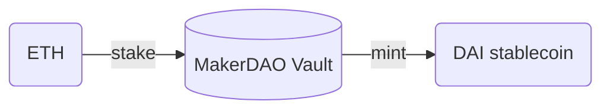
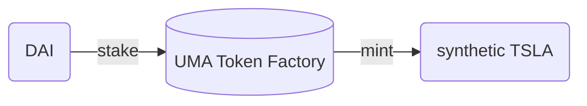
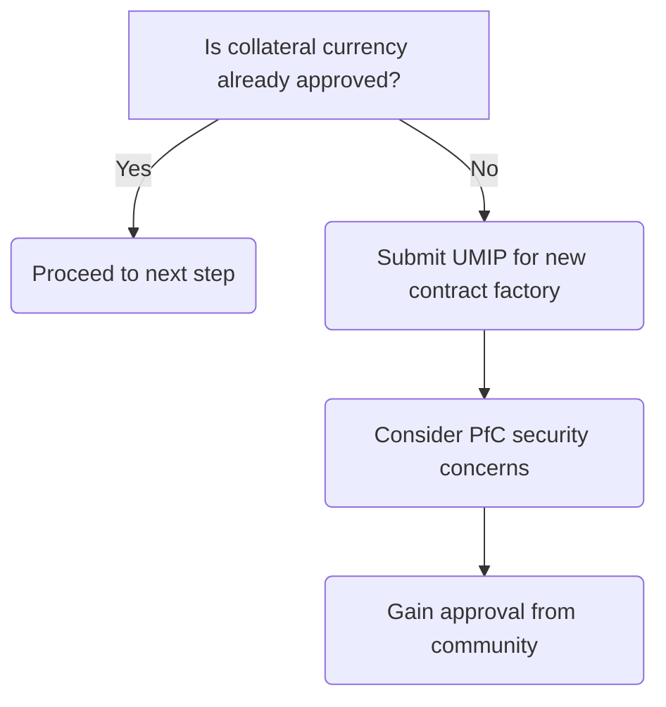
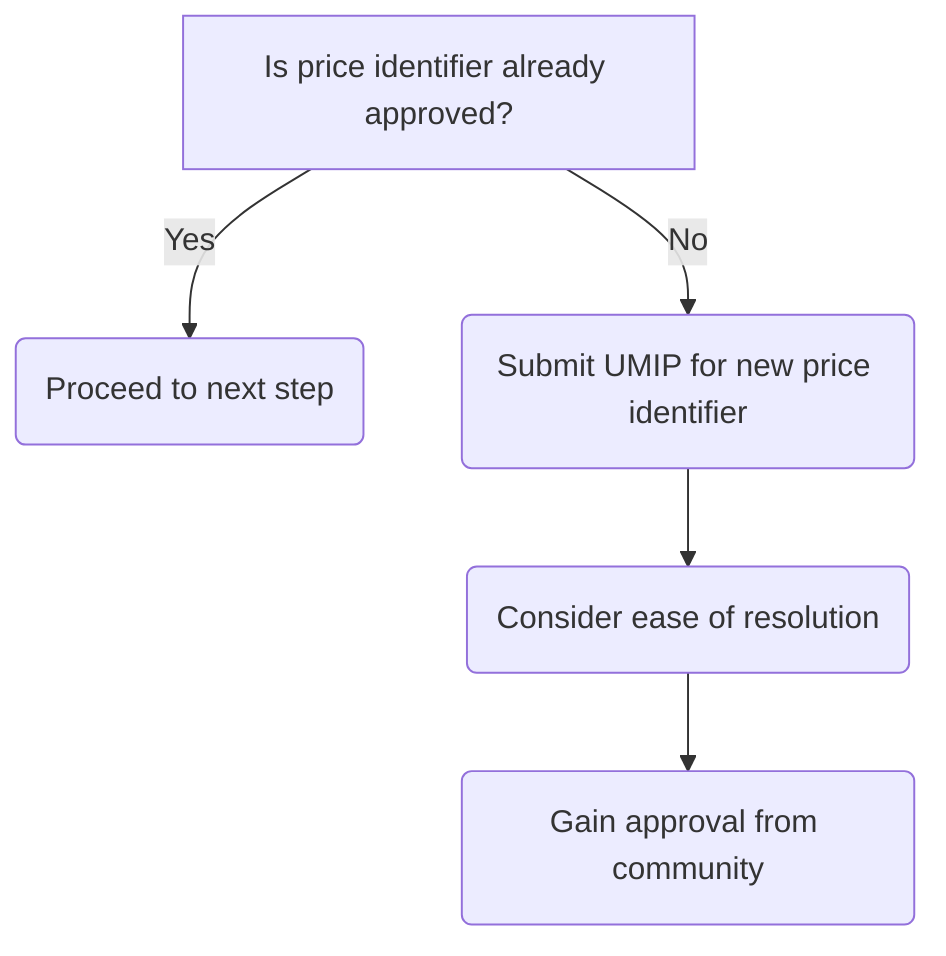
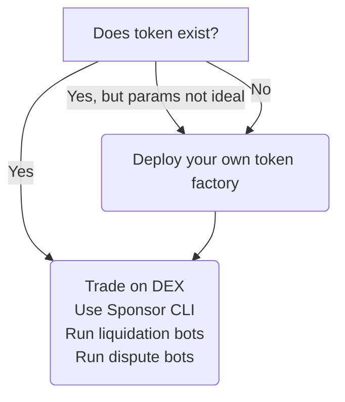

> A token that can be traded anywhere and anytime.

Have you ever wanted to buy a share of Tesla (TSLA)?

Your local time, location of residence, and whether or not you have an account with a brokerage are all factors that determine whether or not you can buy a share of your favorite stock.

But what if I told you that, you can create your own ERC20 token that tracks the price of TSLA, launch it onto the Ethereum Mainnet, and trade it on Uniswap _today_? A token that can be traded anywhere and anytime.

What follows is an overview of how the UMA protocol can allow us to mint TSLA tokens with DAI as collateral.

# How is this possible?

While we don't have access to real TSLA stocks, the UMA protocol allows us to mint any token as long as it's backed by enough collateral (which can be anything that has value).

Sounds magical, right?

But this concept is how MakerDAO has been using ETH collateral to mint DAI (a stablecoin pegged to the USD) since 2018. Conceptually, staking ETH and minting DAI is not all that different from staking something else and minting a TSLA token.





These **synthetic tokens** can be traded as if they were worth the "real thing" without anyone in the system needing to buy or sell a share of TSLA on Nasdaq. This works as long as the system can ensure collateralization, ascertain the price of the underlying asset, and resolve disputes.

# Two requirements

In order to create a synthetic token on UMA, two components need to be approved by UMA token holders:

1. The collateral currency, and;
2. A price identifier.

The collateral currency is the denomination of the backing collateral, which in our case is DAI. Approved collateral tokens are tracked by the `collateralTokenWhitelist` of the `ExpiringMultiPartyCreator` smart contract.

The price identifier is an ID that refers to the source of the underlying asset's price. In our case, this is the string `TSLA`, in reference to the dollar value of one share of TSLA. The `IdentifierWhitelist` smart contract keeps track of approved identifiers.

Thankfully, in our case, both of these have already been approved. However, if you need to seek approval for either of these, then you will need to learn about the UMIP process.

# Getting approval via the UMIPs

UMIP stands for UMA Improvement Proposal, and is the method in which new collateral types and price identifiers can be proposed amongst other governance decisions. This process helps ensure demonstrated community support before a change is approved.

## Proposing a new collateral currency



If the desired collateral currency has not been approved, you can propose an UMIP for a new contract factory template. Here is an example [proposal](https://github.com/UMAprotocol/UMIPs/blob/master/UMIPs/umip-newcontract.md).

Each contract factory template is tied to a specific collateral currency, so by proposing a new contract factory template, we are essentially requesting the approval of a new collateral currency.

When proposing a new collateral currency, you need to consider potential security implications. A new type of collateral can potentially mean a new type of profit for potential hackers (this is what we like to call [Profit from Corruption](https://docs.umaproject.org/uma/getting_started/uma_oracle_design.html#_umas_approach_to_the_oracle_problem), or PfC).

## Proposing a new price identifier



If your desired price identifier has not been approved, you can propose an UMIP to have it included. Here is an example [proposal](https://github.com/UMAprotocol/UMIPs/blob/master/UMIPs/umip-2.md) that demonstrates adding ETHBTC as a price identifier.

The proposal for a price identifier must be specific enough that, when under dispute, UMA token holders can quickly agree on its "true" price. The mechanism for resolving disputes is driven by the Data Verification Mechanism (DVM). A detailed explanation of the DVM is outside the scope of this article.

# Launching your token

To mint a TSLA token, you'll need a token factory contract. This contract is also known as the `ExpiringMultiParty` contract. So named because the token will actually expire, more on this later.

If your desired collateral currency and price feed identifier already exists, then it's possible that a token factory with your desired parameters already exist.

If so, all you need to do is call the `create` method of the token factory with the amount of collateral to be staked and the number of tokens to mint:

```js
await expiringMultiParty.create(
  { rawValue: collateralNeeded.toString() }, // # of DAI tokens in wei
  { rawValue: tokensToMint.toString() }, // # of TSLA tokens in wei
  { from: sponsor }
)
```

However, if you are not happy with the parameters or if it does not exist yet, then you can launch your own by using the `ExpiringMultiPartyCreator` and passing in your desired parameters:

```js
const txResult = await expiringMultiPartyCreator.createExpiringMultiParty(
  constructorParams
)
const expiringMultiParty = await ExpiringMultiParty.at(
  txResult.logs[0].args.expiringMultiPartyAddress
)
```

Note that this article is not meant to be a tutorial, the code above is for illustration only. A full tutorial with a working example is in the works, but in summary:



# What now?

You've minted TSLA tokens and now you can trade them like any other ERC20 token. That means you can potentially create a market for this on Uniswap or any other DEX!

While a perpetual model is in the works, these tokens currently expire. If you were a token sponsor (i.e. you minted these tokens), at anytime **before expiration** you can redeem them for a proportional amount of collateral.

Otherwise, **after expiration**, any token holder can redeem them for an amount of collateral determined by the price of the underlying asset at expiry.

# Further considerations

After minting these tokens, you will need to figure out how to facilitate liquidity for its trading. You might even want to create an interface for trading and redeeming these tokens.

There are also other roles to be played like running a liquidation bot to help keep token factories collateralized or a dispute bot to facilitate governance.

While the theme of this article is to mint tokens that track the TSLA stock price, it could just as well have been anything else like the price of gold or even the temperature for a particular city.

We hope this article demonstrates how the UMA protocol can help anyone mint synthetic tokens. Join us next time for a more in-depth look at some of these other questions.
